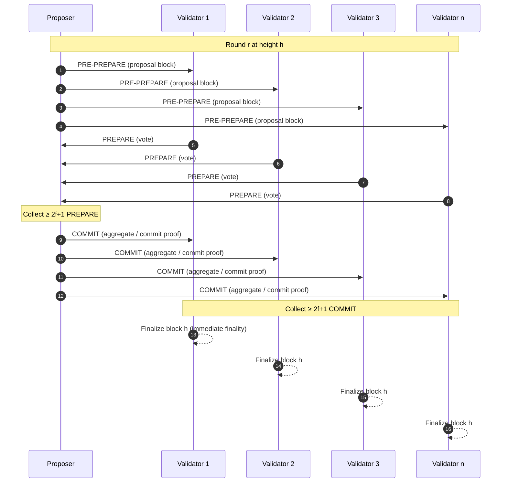

# XGR Chain — IBFT Consensus (PoA, BLS)

**Document ID:** XGRCHAIN-IBFT  
**Status:** Draft  
**Last updated:** 2026-02-07  
**Audience:** Node operators, protocol implementers, auditors

---

## 1. Why IBFT?

XGR Chain uses **IBFT** (Istanbul Byzantine Fault Tolerance), a PBFT-family consensus protocol with:

- **Immediate finality** (no probabilistic reorg depth like PoW)
- Deterministic block production with a **proposer** per height / round
- Fault tolerance against Byzantine validators as long as the validator set respects IBFT assumptions

For XGR Chain, IBFT runs in **Proof-of-Authority (PoA)** mode and validators are **permissioned**.

---

## 2. Fault model and thresholds

Let:

- `n` be the number of validators in the active validator set
- `f = floor((n - 1) / 3)` be the maximum number of Byzantine validators tolerated

IBFT requires:

- `n >= 3f + 1`
- Block finalization requires **≥ 2f + 1** commit votes

**Example (genesis validator set):**  
At genesis, `n = 5` so `f = floor((5-1)/3) = 1` and finalization requires `2f+1 = 3` validators.

---

## 3. Protocol flow (high level)

Each block height `h` proceeds in rounds `r = 0, 1, 2, ...`.

In each round:

1) A designated **proposer** broadcasts a block proposal  
2) Validators exchange **prepare** votes for the proposal  
3) Validators exchange **commit** votes once prepare quorum is reached  
4) Once commit quorum is reached, the block is finalized and appended



> Exact message types and networking details are implementation-specific, but the above reflects the standard PBFT / IBFT phase structure.

---

## 4. Timing configuration on XGR Chain

From `genesis.json`:

| Parameter | Value |
|---|---|
| `blockTime` | `2000000000` ns (~2.0 seconds) |
| `epochSize` | `500` blocks |
| Mode | PoA |
| Validator type | BLS |

---

## 5. BLS validators and aggregated commit seals

XGR Chain uses `validator_type = "bls"`. Practically:

- Each validator has an **ECDSA keypair** which defines the validator **address** (identity)
- Each validator also has a **BLS keypair**
- Commit votes are represented as a **BLS aggregated signature** plus a bitmap of participating validators

This has two key benefits:

- **Smaller consensus proofs** (one aggregated signature instead of many individual signatures)
- Faster verification and storage efficiency

Implementation-wise, the committed seal is represented as an `AggregatedSeal`:

```go
// consensus/ibft/signer/bls.go (abridged)

type AggregatedSeal struct {
    Bitmap    *big.Int // which validators participated
    Signature []byte   // aggregated BLS signature
}
```

---

## 6. Header `extraData` structure (IstanbulExtra)

IBFT stores consensus metadata in the block header `extraData`. The format used is:

- 32 bytes **vanity**
- followed by `RLP(IstanbulExtra)`

The structure (abridged) is:

```go
// consensus/ibft/signer/extra.go (abridged)

type IstanbulExtra struct {
    Validators           validators.Validators
    ProposerSeal         []byte
    CommittedSeals       Seals
    ParentCommittedSeals Seals
    RoundNumber          *uint64
}
```

### 6.1 Genesis `extraData` and initial validator set

In the genesis block, `extraData` encodes the initial validator set and empty seals.

Decoded initial validator set:

| # | Validator address (ECDSA) | BLS public key (48 bytes) |
|---|---|---|
| 1 | 0x7913fdae82c678f42b98ca8076fe7d13b3edff15 | 0xb56b72d028aa6d063d36917f9f18a3ee4b216e22694a701814af4fd55e6cbbe99209fc1359012e4733987ebdd0123e88 |
| 2 | 0x7e8f8fd2a198f77df298041b48d79b0df4c8b1fa | 0xa32a09397128b801da5b88319bcca6cc33d4400e12ef7e1a94141b2360abd70306aaeb5599dd0d0984bb02f88fe20b71 |
| 3 | 0x82f0b6f1efbb3fc9bcde0ee5a08e01e76cc29e13 | 0x8b94120a8ae2a89a0f7deb09f266d90bf5d5152a6ee559977d7f3361a0ce1cc65b012f3a820c7f1c18a01cef9ba8ae90 |
| 4 | 0xc5cc7b4ee5b0f6524ecac177ed37b2b567180707 | 0x91bf571d3f5563976e560c5f7d9898f75a0829804ce5e212370834303c23953388f01e06d0a9da2615c5e7f1aaf10da7 |
| 5 | 0x98f8bc086454b8386788244eee9a43d5d0b4e63e | 0xa65579c3b300f0d8e94e77b3915ac09f309c0a109a3aa3bb66d8beb538d733026624bf9d096e2a3d52deff78a36513d1 |

---

## 7. Validator set changes (PoA governance)

IBFT PoA networks typically manage validator set changes through a **proposal / vote** mechanism.

This codebase includes operator-facing subcommands under `command/ibft/` (Polygon Edge style), including:

- `ibft status` — current status / health
- `ibft snapshot` — view validator set snapshot at a height
- `ibft propose` — propose validator add/remove
- `ibft candidates` — view current candidates
- `ibft quorum` — quorum-related inspection / configuration
- `ibft switch` — consensus switching helper (used in some deployments)

> The exact CLI binary name depends on how you package the node, but the subcommand structure is present in `command/ibft/*`.

---

## 8. Practical operator notes

- **Key material:** For BLS mode, validator operators must securely manage **both** ECDSA and BLS private keys.
- **Network connectivity:** IBFT is sensitive to message delays; ensure stable connectivity between validators.
- **Observability:** Track round changes and proposal/commit timing; persistent round increases are a strong indicator of network issues.

---

## 9. Related documents

- **Chain Spec:** `XGRCHAIN-SPEC`  
- **Gas behavior:** `XRC-GAS_Gas_Price_Behavior.md`
